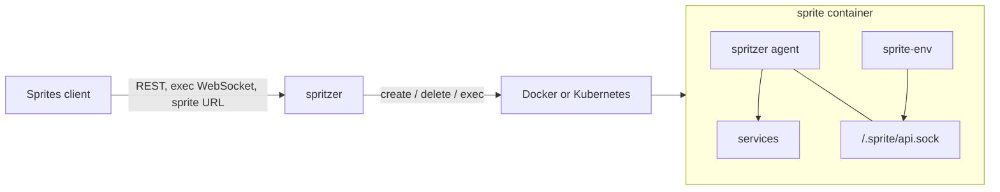

# Container exec mode

By default spritzer runs a scripted interpreter behind exec (see
[Fidelity](fidelity.md)). With `SPRITZER_EXEC=container` each sprite is a real
container instead, so a provisioning script, node, or a long-lived service can
run on it, and its URL reaches what it serves. The README lists the
[environment variables](https://github.com/intentius/spritzer#container-exec-mode).

## How a sprite is built



- The sprite image (`SPRITZER_SPRITE_IMAGE`) is unmodified. Its entrypoint is
  replaced by `/.sprite/bin/spritzer agent`.
- `/.sprite/bin` holds spritzer's Linux binary and a `sprite-env` link to it.
  On Kubernetes an init container from `SPRITZER_AGENT_IMAGE` copies it into an
  `emptyDir`; on Docker it is copied once into a named volume
  (`spritzer-agent-<hash>`) that every sprite mounts read-only.
- The agent supervises services and serves wisp's guest API on
  `/.sprite/api.sock`. It is not PID 1: Docker's init or the pod's pause
  container (with `shareProcessNamespace`) reaps orphans.
- The container's hostname is the sprite's name.

## How spritzer reaches into a sprite

Every interaction is an exec of the agent binary, so no port inside a sprite has
to be routable from spritzer. That matters on Docker Desktop, where container
IPs are not reachable from the host, and it keeps the Kubernetes permissions to
pods and `pods/exec`.

| API | What spritzer execs |
| --- | --- |
| `exec` | `spritzer x-exec --id <id> [--dir] [--env]... -- argv`, which sets the directory and environment, records its pid under the exec id, and becomes the command. If the client disconnects first, `spritzer x-kill <id>` stops the process group. |
| services | `spritzer x-relay unix:/.sprite/api.sock`, used as the connection of an HTTP transport; requests go to the agent verbatim. |
| sprite URL | `spritzer x-relay url`, which connects to the `http_port` service's port, else 8080, retrying for a few seconds while a service binds. |
| filesystem | `spritzer x-fs <op> <path>`, where op is read, write, list or delete. A write takes the query's `mode` as `--mode <octal>`, defaulting to `0644`. |
| create | `spritzer x-ping` until the agent answers. |

On Kubernetes exec uses the `v5.channel.k8s.io` WebSocket protocol, which can
close stdin on its own; on Docker it uses the hijacked exec stream.

## Services

The shapes are wisp's, so `sprite-env` scripts written for wisp or Sprites run
unchanged:

```sh
sprite-env services create door --cmd "$HOME/box/run-door.sh" --needs hud --http-port 8080 --duration 2s --no-stream
sprite-env services list
sprite-env services restart chud
```

From outside, `/v1/sprites/{id}/services/...` is forwarded to the same agent.
`PUT` creates or replaces a service and starts it, streaming NDJSON events
(`started`, `stdout`, `stderr`, `exit`, `complete`) for `?duration`. `needs`
start first; a crash restarts with backoff up to 30s; every defined service
starts when the agent starts. Only one service may have an `http_port`.

## Limits

- No checkpoints or restore: `501` ([#23](https://github.com/intentius/spritzer/issues/23)).
- No TTY exec, no detach and reattach; the exec session list is always empty.
- Logs are not rotated.
- The default image runs as root and has no `sprite` user or `sudo`. A box that
  expects them needs an image that provides them.
- Network policy is stored and returned but not enforced.
