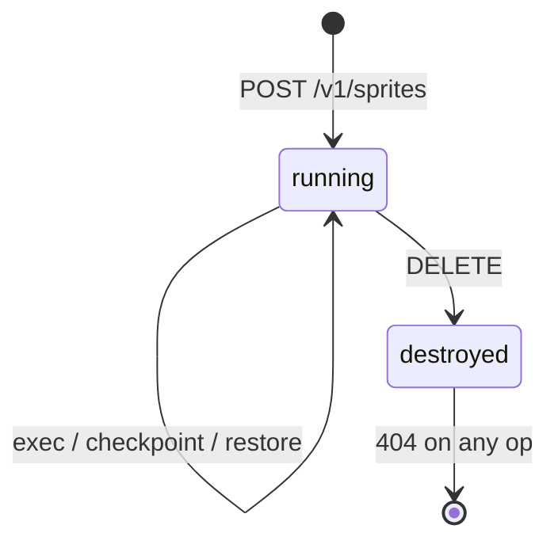

# Fidelity

This page describes what spritzer models faithfully and, just as importantly,
what it deliberately does not.

## The sprite lifecycle

A sprite is created in the `running` state with an empty filesystem and no
checkpoints. `exec` mutates its filesystem. `destroy` moves it to `destroyed`,
after which every operation on it returns `404`, as if it were gone.

The fake's status set is `starting`, `running`, `paused`, and `destroyed`;
spritzer creates sprites `running`, and a restore returns a sprite to `running`.

## The filesystem and exec

A sprite's filesystem is a `path -> contents` map. `exec` runs a small scripted
interpreter (not a real shell) so a test can write a key, then overwrite or fail
it, and prove that a later restore rewinds. See
[API coverage](api-coverage.md#the-exec-interpreter) for the recognized forms.
Segments split on `;` run in order and the last segment's exit code wins,
matching shell `;` semantics.

## Checkpoint and restore

A checkpoint deep-copies the filesystem under a server-assigned version id
(`v1`, `v2`, …, one past the current count); the caller supplies only an
optional comment. A restore addresses a checkpoint by its id in the path,
replaces the filesystem with that copy, and returns the sprite to `running`;
restoring an unknown id is a `404`. `GET .../checkpoints` lists the checkpoints
as `{id, comment}` in creation order, so a compensation workflow can use the
comment as a stable handle and restore the newest matching one. Because the
checkpoint is a deep copy, mutating the filesystem after a checkpoint does not
change what a later restore rewinds to — this is the checkpoint-as-compensation
guarantee a guarded workflow relies on.

## What spritzer does not do

spritzer is an API emulator, not a sandbox platform. It does not:

- Run real sandboxes or execute real commands (exec is a scripted interpreter).
- Pull, resolve, or validate images beyond storing the reference you send.
- Provide real networking or addressable sprite URLs (the `url` is a shape only).
- Enforce quotas, billing, or authentication (the bearer token is ignored).
- Persist across restarts; all state is in memory.

These boundaries are a deliberate limitation. The goal is a faithful model of the
API's stateful behavior — filesystem, checkpoints, and lifecycle — which is what
a client needs to test against, without the weight of the real platform.
